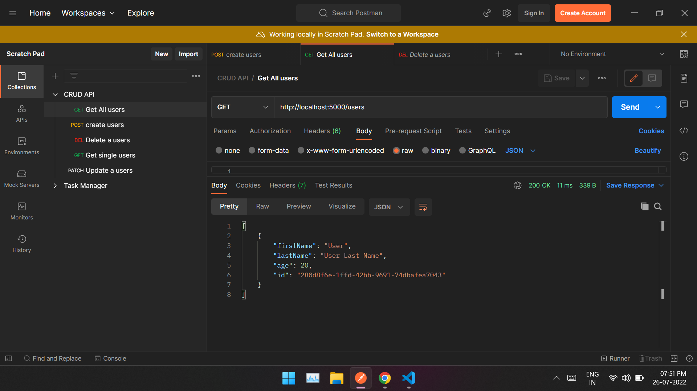
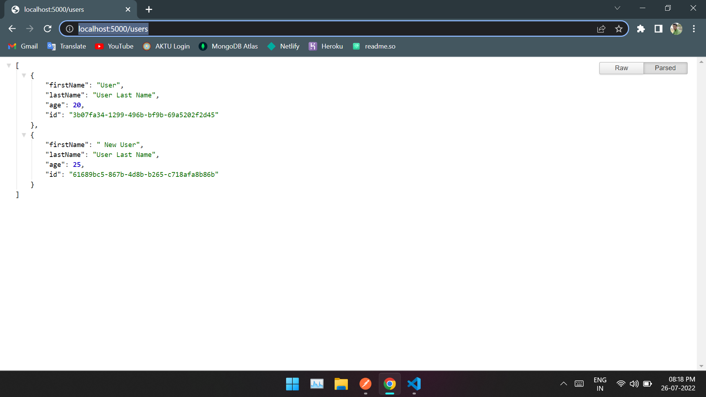

# CRUD Operation

This is a Node-Express project for CRUD operation.
CRUD is an acronym that stands for CREATE, READ, UPDATE, and DELETE.

## Screenshots of Postman



## Screenshots of browser 
'localhost:5000/users'



## Run Locally

Clone the project

```bash
  git clone https://github.com/abhaypsamrat/CRUD-API.git
```

Go to the project directory

```bash
  cd my-project
```

Install dependencies

```bash
  npm install
```

Start the server

```bash
  node index.js
```